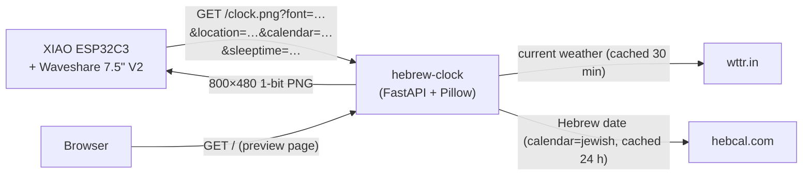

# hebrew-clock

[](LICENSE)
[](https://hub.docker.com/r/techblog/hebrew-clock)
[](https://hub.docker.com/r/techblog/hebrew-clock/tags)


A Hebrew word-clock server that generates 800×480 black-and-white PNG images for e-paper displays. The server expresses the current Israel time in natural written Hebrew, together with an analog clock face, the day and date (Gregorian or Jewish calendar), and a live weather icon. A companion Arduino sketch drives the image onto a [Waveshare 7.5" V2 e-paper panel](https://s.click.aliexpress.com/e/_c3SXnojT) via a Seeed XIAO ESP32C3.

The server is a small [FastAPI](https://fastapi.tiangolo.com/) application that also ships a browser preview page, so you can pick a font, location and calendar and see the result live. The device itself only needs the base URL `https://<host>/clock.png`; font, location and calendar are set in its own config UI.

---

## Table of Contents

- [Features](#features)
- [How It Works](#how-it-works)
- [Display Modes](#display-modes)
- [Web Preview Page](#web-preview-page)
- [API](#api)
- [Available Fonts](#available-fonts)
- [Running with Docker](#running-with-docker)
- [Configuration](#configuration)
- [Running Locally](#running-locally)
- [Deploying to Render](#deploying-to-render)
- [ESP32 Firmware](#esp32-firmware)
- [Security Notes](#security-notes)
- [Troubleshooting](#troubleshooting)
- [Development](#development)
- [Credits](#credits)
- [Contributing](#contributing)
- [License](#license)

---

## Features

- **Natural Hebrew time**: every minute of the day is written out in vocalized Hebrew (with niqqud), e.g. *שֶׁבַע וָרֶבַע* plus a time-of-day word such as *בָּעֶרֶב*.
- **Analog clock face** drawn above the text.
- **Day and date**: Gregorian (day name + day + Hebrew month name) or Jewish calendar (Hebrew day, month and year from [hebcal.com](https://www.hebcal.com)).
- **Live weather**: temperature, a Hebrew condition word and a drawn icon (sun, sun + cloud, cloud, rain, snow, thunder) from [wttr.in](https://wttr.in), no API key required.
- **Five selectable Hebrew font names**, four of which currently have working font files (see [Available Fonts](#available-fonts)).
- **Night image** (`sleeptime=1`) and a built-in **morning quiet screen** (06:00–07:30).
- **E-paper-ready output**: 800×480, 1-bit PNG, thresholded without dithering.
- **Browser preview page** with a copyable device URL, plus `robots.txt`, `sitemap.xml` and Open Graph tags.
- **ESP32-C3 firmware** (`sketch/hebclk.ino`) with a captive-portal Wi-Fi setup, an on-device configuration page, a sleep schedule and optional DS3231 RTC support.
- Multi-arch Docker image (`linux/amd64`, `linux/arm64`) on Docker Hub, and a `render.yaml` blueprint for Render.

---

## How It Works

1. The ESP32 fetches a PNG from the server at a configurable interval.
2. The server renders the current Israel time as written Hebrew words (e.g. *שֶׁבַע וָרֶבַע בָּעֶרֶב*, "quarter past seven in the evening"), draws an analog clock and a weather icon, and returns a 1-bit PNG sized exactly 800×480.
3. The ESP decodes the PNG in RAM and writes it to the e-paper display using a partial refresh.



### Hebrew time phrasing

- Hours are written on a 12-hour clock (*אַחַת* … *שְׁתֵּים עֶשְׂרֵה*), followed by the minutes (*וְדַקָּה אַחַת*, *וָרֶבַע* for :15, *וּשְׁלוֹשִׁים* for :30, and so on). On the full hour only the hour is shown.
- Long phrases are split onto two lines automatically, and each line is shrunk to fit the display width.
- The time-of-day word is shown in the centre cell of the bottom bar:

| Israel time | Word |
|-------------|------|
| 06:00–11:59 | *בַּבֹּקֶר* |
| 12:00–15:59 | *בַּצָּהֳרַיִם* |
| 16:00–17:59 | *אַחַר הַצָּהֳרַיִם* |
| 18:00–20:59 | *בָּעֶרֶב* |
| 21:00–02:59 | *בַּלַּיְלָה* |
| 03:00–05:59 | *לִפְנוֹת בֹּקֶר* |

The server adds `DISPLAY_LAG` seconds (default 8) to the current time before rendering, so the minute shown matches the moment the e-paper refresh finishes.

---

## Display Modes

### Normal clock

The main view shows:
- **Analog clock** at the top centre
- **Hebrew time** in large text (hour + minute phrase)
- **Day name and date** in the bottom-left cell
- **Time-of-day period** (*בַּבֹּקֶר*, *בָּעֶרֶב*, …) in the centre cell
- **Weather** (icon + temperature + condition) in the bottom-right cell; the cell stays empty if no weather data could be fetched yet


*Heebo-Bold font — Raanana, 22°C partly cloudy*


*NotoSansHebrew-Bold font — Tel Aviv*


*Requested with `font=FrankRuhlLibre-Bold` (Jerusalem, 19°C sunny); rendered in NotoSansHebrew-Bold because the bundled FrankRuhlLibre-Bold.ttf is broken*

### Morning quiet window (06:00–07:30)

Between 06:00 and 07:30 Israel time the server returns a minimal "do not disturb" screen (*לֹא לְהָעִיר אַף אֶחָד!*) instead of the clock, so early risers are not bothered by the refresh flicker. The window is fixed in the server code and applies whenever `sleeptime` is not `1`.


*Heebo-Bold font*


*NotoSansHebrew-Bold font*


*Requested with `font=FrankRuhlLibre-Bold`; rendered in NotoSansHebrew-Bold (fallback)*

### Jewish (Hebrew) calendar mode

When `calendar=jewish` is passed, the bottom-left cell shows the full Hebrew date (day numeral, month name and Hebrew year), fetched from the [hebcal.com](https://www.hebcal.com) converter API and cached for 24 hours. If hebcal.com cannot be reached, the Gregorian date is shown instead.


*Hebrew date: כ״ז בְּסִיוָן תשפ״ו*

### Night / sleep mode

When `sleeptime=1` is sent by the ESP (during its configured sleep window), the server returns a dark star-field image with a moon, the `sleeping.png` illustration and the Hebrew message *זְמַן לִישׁוֹן* / *לַיְלָה טוֹב*. If `sleeping.png` is missing from `FONT_DIR`, the image is rendered without the illustration.


---

## Web Preview Page

Open `http://<host>:8765/` in a browser to get a settings panel (font, location, calendar, sleep-mode toggle) with a live preview of the rendered image and a **Device URL** box with a **Copy** button.

For the device, only the base URL matters: set the **Image URL** in the [ESP32 configuration UI](epaper.md#web-configuration-ui) to `https://<host>/clock.png`. The sketch always appends its own `font`, `sleeptime`, `location` and `calendar` parameters (and the last value of a repeated parameter wins), so choose those in the device config UI rather than in the URL.

The page accepts the same `font`, `location` and `calendar` query parameters to pre-fill the form, e.g. `/?font=Heebo-Bold&location=Jerusalem&calendar=jewish`.

<!-- TODO: screenshot of the web preview page -->

---

## API

| Method | Path | Description |
|--------|------|-------------|
| `GET` | `/clock.png`, `/clock` | The clock image (see parameters below). |
| `GET` | `/` | HTML preview page (not an image). |
| `GET` | `/health` | Health check, returns plain-text `OK`. |
| `GET` | `/robots.txt` | Robots file pointing to the sitemap. |
| `GET` | `/sitemap.xml` | Sitemap of preview-page URLs for every font × city × calendar. |
| `GET` | `/api/docs` | Interactive Swagger UI (OpenAPI schema at `/openapi.json`). |

### Clock image

```
GET /clock.png?font=<name>&sleeptime=<0|1>&location=<city>&calendar=<gregorian|jewish>
```

| Parameter | Default | Description |
|-----------|---------|-------------|
| `font` | `NotoSansHebrew-Bold` | Hebrew font. See [Available Fonts](#available-fonts). Unknown names fall back to the default. |
| `sleeptime` | `0` | Set to `1` to render the night image. Any other value renders the clock. |
| `location` | `Tel Aviv` | City passed to the weather service. |
| `calendar` | `gregorian` | `gregorian` for day + Gregorian month; `jewish` for Hebrew date + year (fetched from hebcal.com). Any other value is treated as `gregorian`. |

Response: `image/png`, 800×480, 1-bit, `Cache-Control: no-cache`.

### Example URLs

```
# clock.example.com is a placeholder; replace it with your own server

# Heebo-Bold, Raanana, normal mode
https://clock.example.com/clock.png?font=Heebo-Bold&sleeptime=0&location=Raanana

# Jewish calendar
https://clock.example.com/clock.png?font=Heebo-Bold&sleeptime=0&location=Raanana&calendar=jewish

# Night/sleep image
https://clock.example.com/clock.png?font=Heebo-Bold&sleeptime=1

# Self-hosted
curl -o clock.png "http://localhost:8765/clock.png?font=FrankRuhlLibre&location=Jerusalem"
```

---

## Available Fonts

| Font name | Style |
|-----------|-------|
| `NotoSansHebrew-Bold` | Clean modern sans-serif (default) |
| `Heebo-Bold` | Contemporary sans-serif (the bundled file is the Heebo variable font, which renders at its default Regular weight) |
| `FrankRuhlLibre-Bold` | Currently renders as NotoSansHebrew-Bold: the bundled `FrankRuhlLibre-Bold.ttf` is a broken 14-byte file (`404: Not Found`), so the server falls back |
| `FrankRuhlLibre` | Classic serif, regular weight |
| `DavidLibre-Bold` | Traditional Hebrew typeface |

Font files (`.ttf`) are loaded from the directory set by the `FONT_DIR` environment variable (default: the project root). Four working font files are included; `FrankRuhlLibre-Bold.ttf` is broken (see above). If the requested font file is missing or cannot be loaded, the server silently falls back to `NotoSansHebrew-Bold`, then `FrankRuhlLibre`, then Pillow's built-in font, which has no Hebrew glyphs. The fonts found are logged at startup.

---

## Running with Docker

### Pre-built image

A multi-arch image (`linux/amd64`, `linux/arm64`) is published on Docker Hub as [`techblog/hebrew-clock`](https://hub.docker.com/r/techblog/hebrew-clock), with `latest` and date-based `YYYY.M.PATCH` tags.

```bash
docker run -d --name hebrew-clock -p 8765:8765 \
  -e DISPLAY_LAG=8 \
  --restart unless-stopped \
  techblog/hebrew-clock:latest
```

### Docker Compose (build from source)

```yaml
# docker-compose.yml (already included in the repo)
services:
  hebclk:
    build: .
    ports:
      - "8765:8765"
    environment:
      PORT: 8765
      DISPLAY_LAG: 8   # seconds added to displayed time (compensates for refresh delay)
      LOG_LEVEL: info
    restart: unless-stopped
```

```bash
docker compose up -d
```

To use the published image instead of building, replace `build: .` with `image: techblog/hebrew-clock:latest`.

The image runs as a non-root user, listens on port **8765**, and has a `HEALTHCHECK` on `/health`. The `Dockerfile` copies the `*.ttf` fonts and `sleeping.png` from the project root into `/app/` (the default `FONT_DIR`), and installs Pillow with **libraqm**, which is required to shape right-to-left Hebrew text correctly.

---

## Configuration

Settings are read from environment variables (or a `.env` file in the working directory for the settings marked below).

| Variable | Default | `.env` | Description |
|----------|---------|--------|-------------|
| `DISPLAY_LAG` | `8` | yes | Seconds added to Israel time before rendering (accounts for e-paper refresh time). |
| `FONT_DIR` | project root | yes | Directory containing the `.ttf` files and `sleeping.png`. |
| `GTAG_ID` | *(unset)* | yes | Google Analytics measurement ID; when set, the preview page includes the gtag script. |
| `FORWARDED_ALLOW_IPS` | `*` | yes | Comma-separated IP addresses (or `*`) of reverse proxies trusted for `X-Forwarded-*` headers. `*` suits PaaS hosts such as Render; restrict it when self-hosting behind a known proxy. The pinned uvicorn 0.30.6 matches exact IPs only, not CIDR ranges. |
| `WTTR_URL` | `https://wttr.in` | no | Base URL of the wttr.in-compatible weather service (for example a self-hosted instance). |
| `PORT` | `8765` | yes | Listening port, used only when starting with `python -m app.main`. The Docker image always listens on 8765, and with `uvicorn` you pass `--port` yourself. |

> `LOG_LEVEL` appears in `docker-compose.yml` and `render.yaml`, but the application does not currently read it; Loguru logs at its default level.

**Timezone:** the server does not use the host's timezone. It converts UTC to Israel time itself, so the container needs no `TZ` setting. The conversion is approximate: it uses UTC+3 for the whole of March through October and UTC+2 otherwise, so the server can be an hour off in March (before DST starts) and in late October (after DST ends). The ESP32 sketch uses the correct Israel DST rule for its own sleep schedule.

**Caching:** weather is cached per location for 30 minutes; after a failed request the server waits 10 minutes before retrying and keeps serving the last good value. The Hebrew date is cached per day for 24 hours.

---

## Running Locally

Requires Python 3.12 (the version used by the Docker image) and a Pillow build with libraqm for correct Hebrew shaping (on Debian/Ubuntu: `apt install libraqm0`).

```bash
pip install -r requirements.txt
uvicorn app.main:app --host 0.0.0.0 --port 8765
# or: python -m app.main   (uses PORT, default 8765)
```

Then open `http://localhost:8765/` for the preview page or `http://localhost:8765/clock.png` for the raw image.

---

## Deploying to Render

[Render](https://render.com) is a managed cloud platform that can run the server for free with zero infrastructure setup.

### Prerequisites: font files

Render deploys directly from the repository, so the Hebrew font `.ttf` files and `sleeping.png` must be in the repo root. They are already included in this repository. If you remove some, keep `NotoSansHebrew-Bold.ttf` (or at least `FrankRuhlLibre.ttf`): these are the fallback fonts, and without them the server uses Pillow's default font, which has no Hebrew glyphs.

```
NotoSansHebrew-Bold.ttf   ← recommended minimum
Heebo-Bold.ttf
FrankRuhlLibre-Bold.ttf   ← currently a broken file
FrankRuhlLibre.ttf
DavidLibre-Bold.ttf
sleeping.png
```

### Option A: one-click deploy (render.yaml)

The repo includes a `render.yaml` blueprint. Click the button below, connect your GitHub account, and Render will pre-fill all settings:

[](https://render.com/deploy?repo=https://github.com/t0mer/hebrew-clock)

### Option B: manual setup

1. Log in to [render.com](https://render.com) and click **New → Web Service**.
2. Connect your GitHub account and select the `hebrew-clock` repository.
3. Fill in the service settings:

   | Field | Value |
   |-------|-------|
   | **Name** | `hebrew-clock` (or any name you like) |
   | **Runtime** | `Python 3` |
   | **Build Command** | `pip install -r requirements.txt` |
   | **Start Command** | `uvicorn app.main:app --host 0.0.0.0 --port $PORT` |

4. Under **Environment Variables**, add:

   | Key | Value | Notes |
   |-----|-------|-------|
   | `FONT_DIR` | `.` | Repo root, where the `.ttf` files live |
   | `DISPLAY_LAG` | `8` | Seconds ahead to render (adjust to match your display's refresh time) |

5. Set the **Health Check Path** to `/health`.
6. Click **Create Web Service**. Render will build and deploy; the service URL appears in the dashboard.

> The native Python runtime may not provide libraqm. If the Hebrew text comes out in the wrong order, deploy the Docker image instead (Render also supports Docker-based services). <!-- TODO: verify -->

### Pointing the ESP32 at Render

Once the service is live, copy its URL from the Render dashboard (e.g. `https://hebrew-clock.onrender.com`), append `/clock.png`, and paste `https://hebrew-clock.onrender.com/clock.png` into the **Image URL** field in the [e-paper config UI](epaper.md). Set the font, location and calendar in the device config UI; the sketch appends those parameters itself.

> **Free-tier note:** Render's free plan spins down a service after 15 minutes of inactivity. Because the ESP32 fetches an image every 60 seconds by default, the service stays warm during normal use.

---

## ESP32 Firmware

The client firmware is [`sketch/hebclk.ino`](sketch/hebclk.ino), an Arduino sketch for a **Seeed XIAO ESP32C3** driving a **Waveshare 7.5" V2** (800×480, black/white) panel through GxEPD2 (`GxEPD2_750_T7`).

| XIAO pin | e-paper pin |
|----------|-------------|
| D2 | CS |
| D3 | DC |
| D0 | RST |
| D1 | BUSY |
| 3V3 | VCC |
| GND | GND |
| SCK | CLK |
| MOSI | DIN |

Libraries: GxEPD2, WiFiManager (tzapu), PNGdec, Adafruit GFX and RTClib (Adafruit).

In short: on boot the device opens the **`EPaper-Setup`** Wi-Fi access point for credentials and the image URL, then syncs time over NTP (Israel timezone with DST), serves a configuration page on port 80 (`http://<device-ip>/`) and fetches `<Image URL>?font=…&sleeptime=…&location=…&calendar=…` every *N* seconds (default 60, fixed at 300 s inside the sleep window). Settings are stored in flash (`Preferences`).

> **HTTPS required:** the sketch always fetches through `WiFiClientSecure`, so a plain `http://` Image URL will most likely fail. When self-hosting, put the server behind a TLS reverse proxy and use an `https://` URL. <!-- TODO: verify on device -->

See **[epaper.md](epaper.md)** for full instructions on:
- Adding the ESP32 board to Arduino IDE
- Installing required libraries
- First-boot Wi-Fi setup
- Web configuration UI reference
- Optional DS3231 RTC module (keeps the sleep schedule working without NTP)


*Configuration UI: Calendar type dropdown (Gregorian / Jewish) and DS3231 RTC option*

### Flashing from the browser

This firmware is also listed as the `hebrew-clock` product in [heb-clock-flasher](https://github.com/t0mer/heb-clock-flasher), a self-hosted browser-based flasher (Web Serial + esptool-js) for the Hebrew e-paper clocks, if you prefer not to install the Arduino IDE.

---

## Security Notes

- The server has **no authentication**. Every endpoint, including `/api/docs`, is public; put it behind a reverse proxy or firewall if you do not want it exposed.
- `FORWARDED_ALLOW_IPS` defaults to `*`, which trusts `X-Forwarded-*` headers from any client. Set it to your proxy's address when self-hosting.
- The `location` parameter is forwarded (URL-encoded) to wttr.in, and the current date to hebcal.com; no other data leaves the server.
- The ESP32 sketch uses `WiFiClientSecure::setInsecure()`, so HTTPS image fetches are encrypted but the server certificate is **not verified**.
- The device configuration page (port 80) has no password; anyone on the same network can change its settings.
- The Docker image runs as an unprivileged user (UID 10001).

---

## Troubleshooting

| Symptom | Cause / fix |
|---------|-------------|
| Device Serial shows `PNG open error` | The **Image URL** points at the server root (`https://host/`), which now serves the HTML preview page. Use `https://host/clock.png`. |
| Device Serial shows `Wrong dimensions` | The URL does not return an 800×480 image from this server. |
| Image is cut off or fails to decode | The sketch buffers at most 30,000 bytes of PNG; responses larger than that are truncated. |
| Hebrew letters appear in reverse order | Pillow was installed without libraqm. Use the Docker image or install `libraqm0` and reinstall Pillow. |
| Log warning `no Hebrew font files found` | `FONT_DIR` does not contain the `.ttf` files; the image falls back to Pillow's default font. |
| Weather cell is empty | wttr.in could not be reached or did not recognize the `location`. Check the `weather error` log line; the server retries after 10 minutes. |
| `EPaper-Setup` portal appears after every reboot | The sketch calls `wm.resetSettings()` in `setup()`, which clears the saved Wi-Fi credentials on each boot. |
| Image URL or refresh interval is blank after the portal | Saving the portal overwrites the stored Image URL and interval with the portal's fields, even when they are left empty. Enter the URL in the portal, or set it afterwards on the device config page (`http://<device-ip>/`). |
| Device fetch fails with an HTTP error on an `http://` URL | The sketch always uses `WiFiClientSecure`; serve the image over HTTPS (TLS reverse proxy). <!-- TODO: verify on device --> |
| Clock is an hour off in March or late October | The server's Israel-time conversion switches DST by whole months (March to October). Nothing to configure; this is a known limitation of the server code. |
| `font=FrankRuhlLibre-Bold` looks like Noto Sans Hebrew | The bundled `FrankRuhlLibre-Bold.ttf` is a broken 14-byte file, so the server falls back to NotoSansHebrew-Bold. |
| Night image never appears | `sleeptime=1` is sent only when the device's sleep schedule is enabled and its clock is set (NTP or DS3231). |

---

## Development

```bash
pip install -r requirements.txt -r requirements-dev.txt
pytest          # tests in tests/
ruff check .    # lint (currently reports 12 existing errors)
```

Releases are built by the manual **Docker Build** GitHub Actions workflow (`.github/workflows/docker-image.yml`), which computes a `YYYY.M.PATCH` version with `scripts/next-version.sh`, tags the commit and pushes the multi-arch image to Docker Hub. A second manual workflow, `publish-ghcr.yml`, can push the image to `ghcr.io/t0mer/hebrew-clock`.

### Project Structure

```
app/
  main.py              # FastAPI app, lifespan, /health, static files
  api/v1/router.py     # /, /clock, /clock.png, /robots.txt, /sitemap.xml
  core/config.py       # Settings (pydantic-settings)
  services/
    clock.py           # Image generation (Pillow, Hebrew word-clock logic)
    weather.py         # wttr.in weather cache
    jewish_cal.py      # hebcal.com Hebrew date fetch + cache
    seo.py             # robots.txt and sitemap.xml generation
  templates/index.html # Web preview page
  static/              # Tailwind CSS
sketch/
  hebclk.ino           # ESP32 Arduino sketch
tests/                 # pytest suite
scripts/next-version.sh
assets/screenshots/    # README images
*.ttf, sleeping.png    # Fonts and night-mode illustration
epaper.md              # Device setup guide
Dockerfile
docker-compose.yml
render.yaml
requirements.txt
requirements-dev.txt
```

---

## Credits

- Weather data: [wttr.in](https://wttr.in).
- Hebrew calendar conversion: [hebcal.com](https://www.hebcal.com).
- Fonts, all licensed under the [SIL Open Font License 1.1](https://openfontlicense.org/):
  - [Noto Sans Hebrew](https://github.com/notofonts/hebrew), The Noto Project Authors
  - [Heebo](https://github.com/OdedEzer/heebo), Oded Ezer
  - [Frank Ruhl Libre](https://github.com/fontef/frankruhllibre), Yanek Iontef
  - [David Libre](https://github.com/meirsadan/david-libre), The David Libre Project Authors (Meir Sadan et al.)
  - Open Sans and Playpen Sans Hebrew are also bundled in the repository but are not currently selectable.

---

## Contributing

Issues and pull requests are welcome. Please run `pytest` (and `ruff check .`, which currently reports 12 pre-existing errors) before opening a PR.

---

## License

This project is licensed under the [Apache License 2.0](LICENSE). The bundled fonts keep their own SIL Open Font License.
