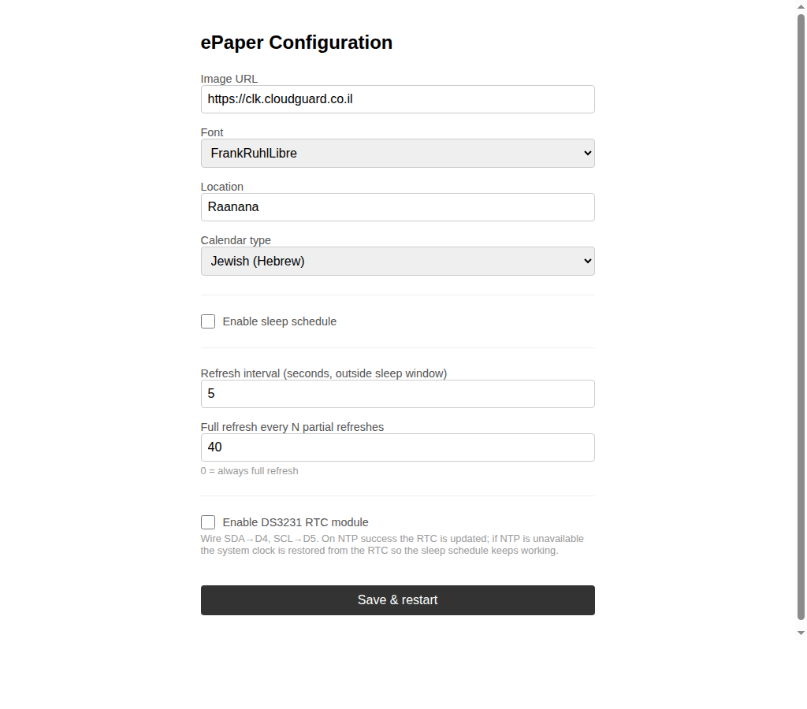

# ePaper Display Setup (ESP32)

The `sketch/hebclk.ino` sketch runs on a **Seeed XIAO ESP32C3** connected to a **Waveshare 7.5" V2** (800×480) e-paper display. On first boot it creates a Wi-Fi access point for configuration; afterwards it fetches a new clock image from the server at a configurable interval and renders it on the display.

---

## Hardware

| Part | Details |
|------|---------|
| MCU | Seeed XIAO ESP32C3 |
| Display | Waveshare 7.5" V2 e-paper (800×480, B/W) |

### Wiring

| XIAO pin | ePaper pin |
|----------|-----------|
| D2 | CS |
| D3 | DC |
| D0 | RST |
| D1 | BUSY |
| 3V3 | VCC |
| GND | GND |
| SCK | CLK |
| MOSI | DIN |

---

## Adding the Board to Arduino IDE

### 1. Install ESP32 board support

1. Open **Arduino IDE → Preferences** (`Ctrl+,` / `⌘+,`).
2. Paste the following URL into **Additional Boards Manager URLs**:
   ```
   https://raw.githubusercontent.com/espressif/arduino-esp32/gh-pages/package_esp32_index.json
   ```
3. Click **OK**.
4. Open **Tools → Board → Boards Manager**, search for **esp32**, and install the package by **Espressif Systems** (≥ 3.x recommended).
5. Select **Tools → Board → esp32 → XIAO_ESP32C3**.

### 2. Select upload settings

| Setting | Value |
|---------|-------|
| Board | XIAO_ESP32C3 |
| Upload Speed | 921600 |
| USB CDC On Boot | Enabled |
| Port | the COM/tty port of your XIAO |

---

## Required Libraries

Install each library via **Sketch → Include Library → Manage Libraries…**:

| Library | Tested version | Purpose |
|---------|---------------|---------|
| **GxEPD2** by ZinggJM | ≥ 1.6 | e-paper display driver |
| **WiFiManager** by tzapu | ≥ 2.0 | captive-portal Wi-Fi setup |
| **PNGdec** by Larry Bank | ≥ 1.0 | in-RAM PNG decoder |
| **Adafruit GFX** | ≥ 1.11 | required by GxEPD2 |

> **Note:** The sketch uses `WiFiClientSecure`, `Preferences`, `HTTPClient`, `WebServer`, and `time.h` — all bundled with the ESP32 Arduino core; no separate install needed.

---

## First-Boot Wi-Fi Setup

1. Flash the sketch. On first boot (or after `wm.resetSettings()`) the XIAO creates an access point named **`EPaper-Setup`**.
2. Connect to it from a phone or laptop.
3. A captive portal opens — enter your Wi-Fi SSID/password and the **Image URL** of your hebclk server (e.g. `https://clk.cloudguard.co.il/`).
4. The device saves the credentials, connects to your network, and immediately fetches the first clock image.

---

## Web Configuration UI

After connecting, the device runs a small web server on port 80. Open `http://<device-ip>/` in a browser to reach the configuration page.



### Settings

| Field | Description |
|-------|-------------|
| **Image URL** | Base URL of the hebclk server. Font, location, and sleep-time are appended automatically. |
| **Font** | One of the five Hebrew fonts available on the server. |
| **Location** | City name passed to the weather service (e.g. `Tel Aviv`, `Raanana`, `Jerusalem`). |
| **Enable sleep schedule** | When checked, reveals start/end times. During this window the refresh rate switches to 5 min and the server shows the night image. |
| **Sleep start / Sleep end** | 24-hour HH:MM times defining the sleep window (overnight ranges supported, e.g. 22:00 – 06:00). |
| **Refresh interval** | How often (seconds) to fetch a new image outside the sleep window. |
| **Full refresh every N** | Partial refreshes are faster but ghosting accumulates. Set to 0 for always-full. |

Click **Save & restart** — the device saves settings to flash and reboots.

---

## How the URL Is Built

The sketch appends query parameters to the configured base URL before each fetch:

```
<Image URL>?font=<selectedFont>&sleeptime=<0|1>&location=<location>
```

- `sleeptime=1` is sent only when the device's local time falls within the configured sleep window.
- The location string is URL-encoded on the device.

Example:
```
https://clk.cloudguard.co.il/?font=Heebo-Bold&sleeptime=0&location=Raanana
```

---

## Refresh Strategy

| Condition | Interval | Refresh type |
|-----------|---------|-------------|
| Normal operation | Configured value (default 60 s) | Partial every N, then full |
| Inside sleep window | Fixed 300 s (5 min) | Same partial/full cadence |

A **partial refresh** is faster (~1 s) but leaves slight ghosting over time. A **full refresh** (~15 s) clears ghosting completely. The default `fullRefreshEvery = 10` means every 10th update is a full refresh.
